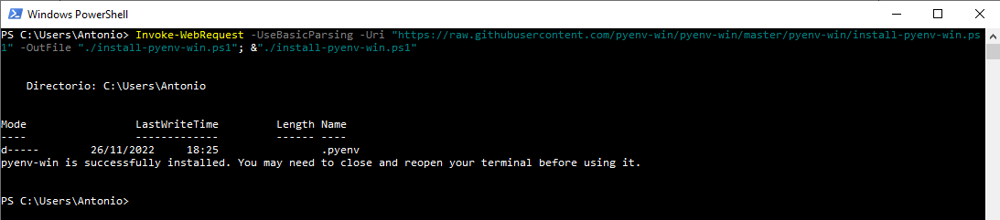
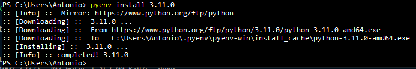

# Pyenv for Windows
Quick guide to install pyenv on Windows PowerShell

## Introduction

As a developer, you need agility in changing between python versions. Here we come with an excellent option. 

Pyenv is a command line tool that enables you to switch from one version to another, install specific packages for each version or execute a particular python script that only runs with a previous version than yours.

## Installation


1. Open your PowerShell terminal
2. Execute this command:
    ```powershell
    > Invoke-WebRequest -UseBasicParsing -Uri "https://raw.githubusercontent.com/pyenv-win/pyenv-win/master/pyenv-win/install-pyenv-win.ps1" -OutFile "./install-pyenv-win.ps1"; &"./install-pyenv-win.ps1"
    ```

    You can see something like this image:

    

3. Close and reopen your terminal before using it.

## First steps

1. Check the current pyenv version you just install.
    ```powershell
    > pyenv --version
    ```
2. List all possible commands you can execute with pyenv.
    ```powershell
    > pyenv help
       commands    List all available pyenv commands
   local       Set or show the local application-specific Python version
   global      Set or show the global Python version
   shell       Set or show the shell-specific Python version
   install     Install a Python version using python-build
   uninstall   Uninstall a specific Python version
   rehash      Rehash pyenv shims (run this after installing executables
   version     Show the current Python version and its origin
   versions    List all Python versions available to pyenv
   which       Display the full path to an executable
   whence      List all Python versions that contain the given executable
   ```
3. Install your preferred python version
   1. First, you can check the available python versions you can install through pyenv.
    ```
    > pyenv install -l
    ```
   2. Once you choose your option, go to the install command.
    ```powershell
    > pyenv install 3.11.0
    ```
    
4. Set the python installation as your python version on pyenv.
    ```powershell
    > pyenv global 3.11.0
    ```

5. Now you can install more versions and switch between them using steps 3 and 4 for each new version you need.


(Source: https://github.com/pyenv-win/pyenv-win#introduction)